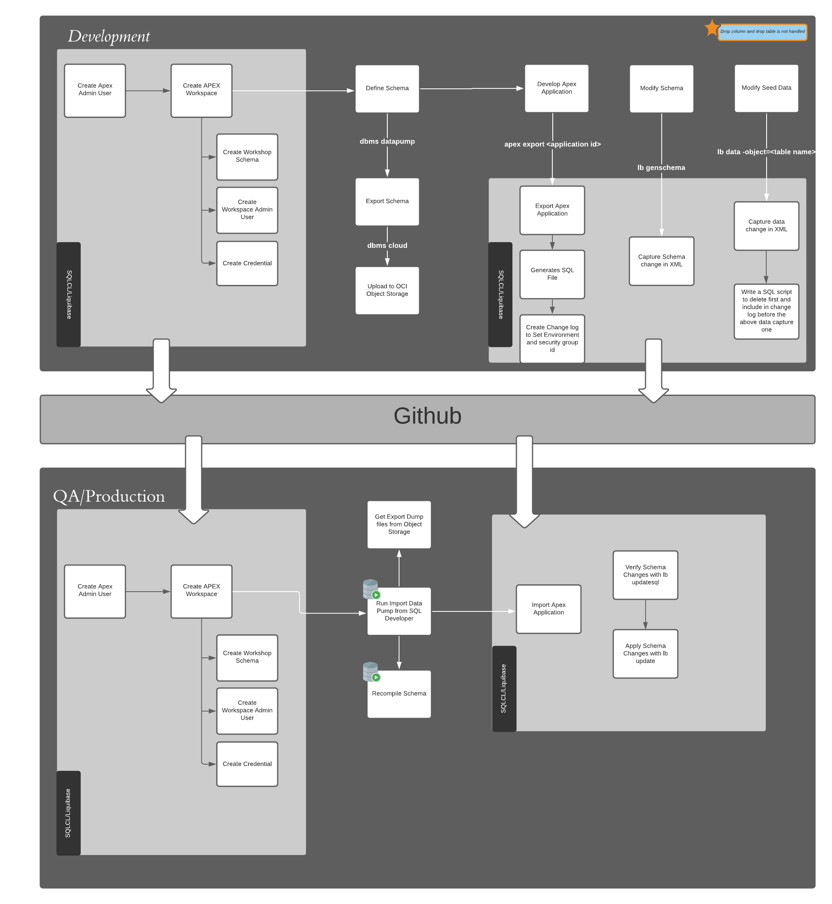

# Apex CI-CD workflow template

## **Reference Architecture**



### ***Prerequisites***

1. Download latest JAVA and JDK library from [here](https://www.oracle.com/java/technologies/javase-downloads.html)

```
<copy>
  mkdir ~/java
  cd ~/java
  tar -xf /tmp/<java zipped archive>
  ln -s ./j* ./<jdk version>
</copy>  
```

2. Download SQLcl from [here](https://www.oracle.com/tools/downloads/sqlcl-downloads.html)

3. Place the SQLcl download in the scripts folder

4. run:

  ```bash
  ./script/setup_env.sh
  ```

## **STEP 1:** Terraform setup

1. Get in the `terraform` folder

  ```bash
  cd terraform
  ```

2. Create a `TF_VARS.sh` file

  ```bash
  cp TF_VARS.tpl TF_VARS.sh
  ```

3. Edit with your favorite editor and populate the following:

  ```bash
  export TF_VAR_user_ocid=ocid1.user.oc1..
  export TF_VAR_fingerprint=dc:6e:1c:d4:76:...
  export TF_VAR_private_key_path=~/.oci/oci_api_key.pem
  export TF_VAR_tenancy_ocid=ocid1.tenancy.oc1..
  export TF_VAR_region=us-ashburn-1
  ```

4. Create a `terraform.tfvars` file from template

  ```bash
  cp terraform.tfvars.template terraform.tfvars
  ```

5. Populate the required variables

  ```
  region="us-ashburn-1"
  compartment_id="ocid1.compartment.oc1.."
  ```

  and edit the schema, workspace and user names as desired.

## **STEP 2:** Deploy

1. The whole stack and environments can be deployed and configured in one command:

  ```bash
  make init
  ```
  
  The terraform stacks generates environment files for each environment. The files are on the root folder, named *`<env_name>.env`* and contain the credentials for each user/schema/workspace


## **STEP 3:** The makefile

1. The makefile in this repository simplifies a lot of the tasks to be performed. Try 

  ```bash
  make help
  ```

  For the full list of functions:

  ```bash
  help                           This help.
  install-deps                   Install required dependencies
  sql                            SQLcl shell as APEX ADMIN user
  wallet                         Get the Database wallet
  tf-apply                       Run the terraform stack
  tf-destroy                     Destroy the terraform stack
  create-apex-admin              Create the APEX admin user
  delete-apex-admin              Delete the APEX admin user
  create-cloud-creds             Create default cloud credential for the APEX ADMIN user to use datapump to Object Storage 
  create-schema                  Create schema
  delete-schema                  Delete schema
  create-ws                      Create schema, workspace, add schema to workspace and create workspace admin user
  delete-ws                      Delete workspace and its users
  export-app                     Export the Apex App. Specify ID=<app_id>
  import-app                     Import the Apex App. Specify ID=<app_id>
  changelog                      Generate a new Change Log for the schema
  update-schema                  Apply the Change Log to the schema
  snapshot                       Create a new change Log, and export the app. Specify ID=<app_id>
  update                         Apply the Change Log to the schema and import the app. Specify ID=<app_id> NEWID=<new_app_id>
  init                           Deploy the database(s) and setup all the defined environments  
  ```

2. Oracle Autonomous Database has `admin` user by default which has all the special privileges to run as a administrator ,  for the purpose of APEX workspace provisioning and management we will be creating `apexadmin` user. 

## **STEP 4:** Start developping

1. You can create a new application in the APEX interface, or use a template application from the gallery.

2. If you used an app from the gallery, make sure to UNLOCK it before the next steps:

  


## **STEP 5:** Take a snapshot of the state of the app

1. We use the LiquiBase tool to create snapshots of the schema, and the apex export tool to export the app itself.

2. Take a snapshot of the app state with:

  ```bash
  make snapshot ID=<app_id>
  ```

  This will create a changelog of the schema and export the app.

  You can run the operations separately with:

  ```bash
  make changelog
  ```

  and

  ```bash
  make export-app ID=<app_id>
  ```

## **STEP 6:** Deploy the app to another environment

1. With the app export and the schema changelog, we can reproduce the full application to another environment with:

  ```bash
  make update ID=<original_app_id> NEWID=<new_app_id> ENV=prod
  ```

  Note that APEX APP IDs must be *unique* within a single database (regardless of SCHEMA or WORKSPACE), so if you created the `prod` environment in the same database as the `dev` environment, the *`new_app_id`* MUST be different from the *`original_app_id`*. We recommend using a fixed offset (like 1000)

  If you are deploying on a separate database, make the *`new_app_id`* the same as the *`original_app_id`* for consistentcy across environments.


## **STEP 7:** Create other environments

1. The `make` commands above take a variable *`ENV`* that define what `.env` file to use to create the environment. To create another environment, duplicate one of the `.env` file and rename it.

  *If you use the same target database, you MUST change the name of the SCHEMA and the WORKSPACE in the new `.env` file*

2. Get the wallet for the DB for this other environment:

  ```bash
  make wallet ENV=prod
  ```

  (prod being the basename of the .env file to use: `prod.env`)

3. Then you can create the schema and workspace for the new environment using:

  ```bash
  make create-ws ENV=prod
  ```

  *If you use a separate database, it is recommended to use the same SCHEMA and WORKSPACE names, but change the passwords*

  *You also need to create the APEX admin user in the new database* with:

  ```bash
  make create-apex-admin ENV=prod
  ```


2. Export files are written into `DATA_PUMP_DIR` by default and in a Autonomous database you can access it by
```
<copy>
  select object_name, bytes
  from dbms_cloud.list_files('DATA_PUMP_DIR') WHERE object_name like '%dmp%`

 </copy>
 ```

### **STEP 5**: Prepare to export apex application
  You can enter the application id of the APEX application when generating

  ```
 <copy>
 $ cd <directory where you want to store the apex file>
 $sql /nolog
 SQL> set cloudconfig  <wallet downloaded directory>/<wallet zip file>
 SQL> conn workshop/<password>@<service name>
 SQL>  lb genobject -type apex -applicationid <application id>
 </copy>
 ```
Download the SQLCL from https://www.oracle.com/tools/downloads/sqlcl-downloads.html (https://download.oracle.com/otn/java/sqldeveloper/sqlcl-20.4.1.351.1718.zip)


```
scp -i ~/.ssh/sqlcl sqlcl-20.4.1.351.1718.zip opc@129.213.145.126:/tmp

cd ~
unzip -q /tmp/sqlcl-20.4.1.351.1718.zip
export JAVA_HOME=${HOME}/java/
alias sql="${HOME}/sqlcl/bin/sql"

```


Login to the APEX Workspace as *WORKSP_ADMIN* with  default password *WELcome##12345* , Import the Opportunity Tracker application and Unlock the application


Once Installed unlock the application to make modification


### **Steps for Rollback changes to the application **:

if you want to rollback the changes, write a custom script or use SQLCL rollback command to rollback number of changes or by date

```
lb rollbacksql -changelog controller.xml -count 1
```
